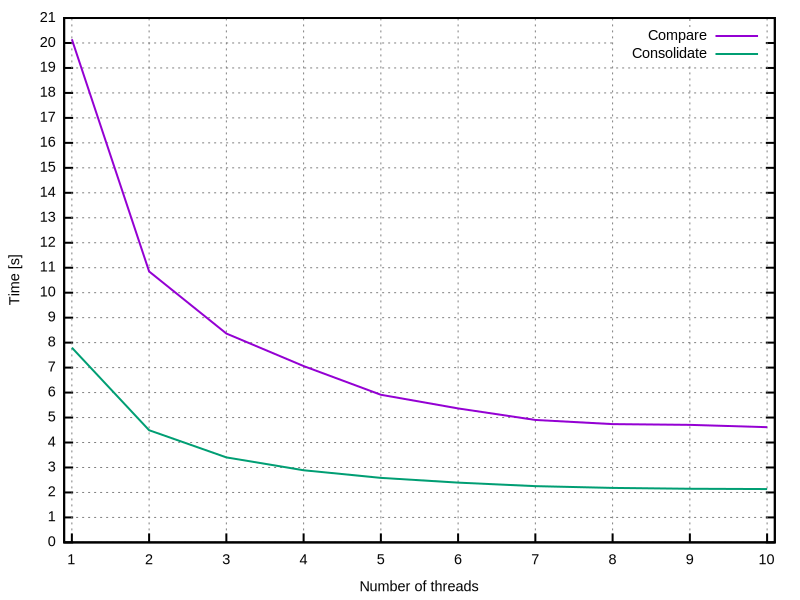

# suse-kabi-tools

## Overview

suse-kabi-tools is a set of Application Binary Interface (ABI) tools for the Linux kernel.

The project contains the following utilities:

* ksymtypes – a tool to work with symtypes files, which are produced by [genksyms][genksyms] during
  the Linux kernel build. It allows you to consolidate multiple symtypes files into a single file
  and to compare symtypes data.
* ksymvers – a tool to work with symvers files, which are produced by [modpost][modpost] during the
  Linux kernel build. It allows you to compare symvers data, taking into account specific severity
  rules.

The tools aim to provide fast and detailed kABI comparison. The most time-consuming operations can
utilize multiple threads running in parallel.

The project is implemented in Rust. The code depends only on the standard library, which avoids
bloating the build and keeps project maintenance low.

## Installation

Ready-to-install packages for (open)SUSE distributions are available in [the Kernel:tools
project][kernel_tools] in the openSUSE Build Service.

To build the project locally, install a Rust toolchain and run `cargo build`.

## Usage

Manual pages: [ksymtypes(1)][ksymtypes_1], [ksymvers(1)][ksymvers_1],
[suse-kabi-tools(5)][suse_kabi_tools_5].

The primary use case for these tools is to maintain a stable kABI in a Linux distribution kernel.

A typical package build recipe that utilizes suse-kabi-tools looks as follows:

    ➊ cd ${LINUX_TREE}
    ➋ make O=linux-obj

    ➌ cp linux-obj/Module.symvers symvers-default
    ➍ ksymtypes consolidate -j${BUILD_NCPUS} --output=symtypes-default linux-obj/

    ➎ res=0
    ➏ ksymvers compare --rules=kabi/severities --format=mod-symbols:changed-exports \
          --format=short kabi/symvers-default symvers-default || res=$?
    ➐ if [ $res -ne 0 ]; then
    ➑     ksymtypes compare -j${BUILD_NCPUS} --filter-symbol-list=changed-exports \
              --format=short kabi/symtypes-default symtypes-default
    ➒ fi

Lines 1–2 change the current working directory to the Linux source directory and perform a standard
build.

Lines 3–4 collect symvers and symtypes data from the build, which describe the kernel ABI. The
symvers data are contained in a single file that can be copied using the `cp` command. The symtypes
data are distributed across multiple files and are consolidated into a single file by the `ksymtypes
consolidate` command.

Lines 5–9 compare the new kABI data with the reference stored in the `kabi/` directory. First, the
`ksymvers compare` command is used to compare the resulting symbol CRCs with the reference in
`kabi/symvers-default`. The reference file should originate from a specific base build when the kABI
was frozen. The comparison takes into account the kABI severity rules specified in the
`kabi/severities` file. The command outputs a brief report of all changes to the standard output and
saves the names of all modified symbols in the `changed-exports` file. If any differences are found,
the `ksymtypes compare` command is executed to compare the symtypes data from the current build with
the reference in `kabi/symtypes-default`. This comparison provides detailed information about the
underlying types that have changed.

Example output of the comparison commands:

    $ ksymvers compare --rules=kabi/severities --format=mod-symbols:changed-exports \
        --format=short kabi/symvers-default symvers-default
    Export 'async_schedule_node_domain' changed CRC from '0xd21b61bd' to '0xe8c70692'
    Export 'async_synchronize_cookie_domain' changed CRC from '0x286cc647' to '0xd0721148'
    Export 'async_synchronize_full_domain' changed CRC from '0x6ca4bf88' to '0x0064dc62'
    Changes tolerated by rules: '5' additions, '9' removals, '7' modifications

    $ ksymtypes compare -j8 --filter-symbol-list=changed-exports \
        --format=short kabi/symtypes-default symtypes-default
    The following '3' exports are different:
     async_schedule_node_domain
     async_synchronize_cookie_domain
     async_synchronize_full_domain

    because of a changed 's#async_domain':
    @@ -1,4 +1,4 @@
     struct async_domain {
            s#list_head pending;
    -       unsigned registered : 1;
    +       t#bool registered;
     }

## Performance

The following graph shows the time needed to consolidate the entire kABI data and to compare it with
a reference. The test was performed on an AMD Ryzen 7 PRO 7840U, which has a total of 8 cores and 16
threads. Each measurement is an average of 5 runs.

## License

This project is released under the terms of [the GPLv2 license](COPYING).

[genksyms]: https://github.com/torvalds/linux/tree/master/scripts/genksyms
[modpost]: https://github.com/torvalds/linux/tree/master/scripts/mod
[ksymtypes_1]: https://suse.github.io/suse-kabi-tools/ksymtypes.1.html
[ksymvers_1]: https://suse.github.io/suse-kabi-tools/ksymvers.1.html
[suse_kabi_tools_5]: https://suse.github.io/suse-kabi-tools/suse-kabi-tools.5.html
[kernel_tools]: https://build.opensuse.org/package/show/Kernel:tools/suse-kabi-tools
